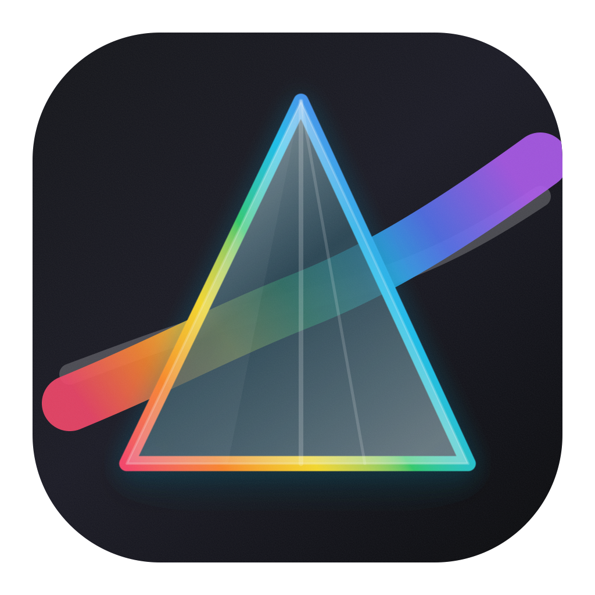
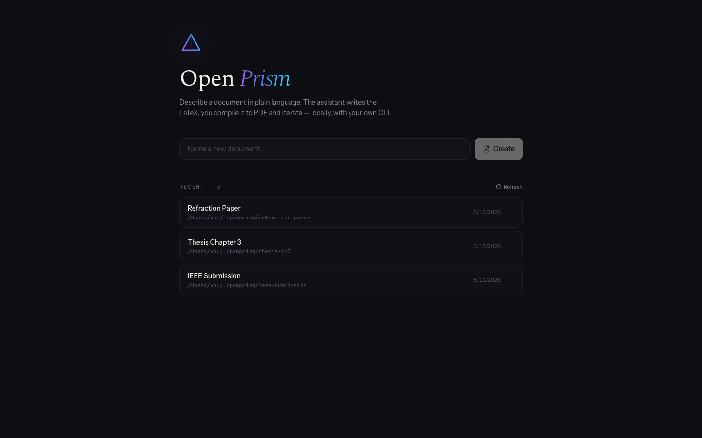
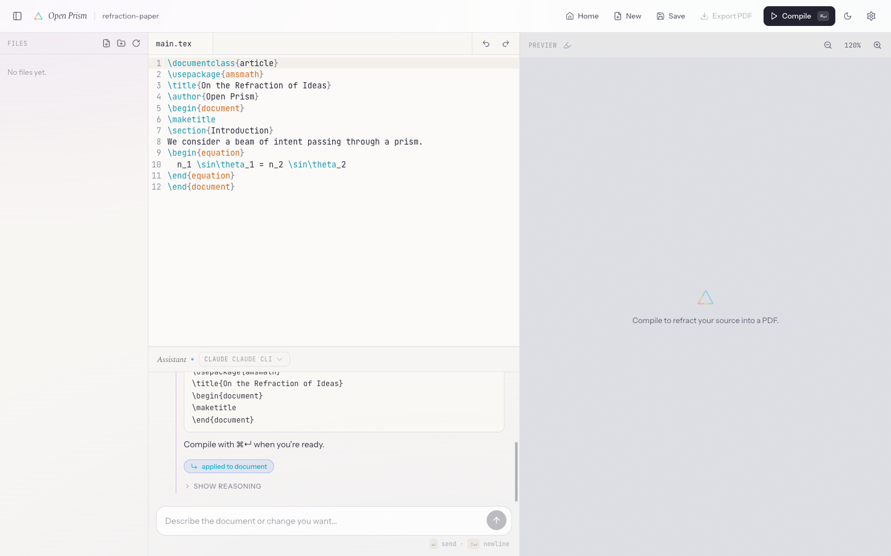

<p align="center">
  
</p>

<h1 align="center">Open Prism</h1>

<p align="center">
  A LaTeX workspace powered by your local <strong>Claude CLI</strong> — describe a document in plain language and watch Claude write, compile, and fix the LaTeX for you.
</p>

<p align="center">
  <a href="https://github.com/VishiATChoudhary/open-prism/releases/latest">
    
  </a>
  <a href="#develop">
    
  </a>
  <a href="#license">
    
  </a>
</p>

<p align="center">
  
</p>

<p align="center">
  
</p>

## What It Is

Open Prism is a desktop LaTeX environment built around the **Claude CLI**.
Instead of bolting an API key onto a chat box, it spawns your locally installed,
already-authenticated [`claude`](https://docs.claude.com/en/docs/claude-code)
command — so the same Claude you run in your terminal drafts and revises the
LaTeX, while you compile with Tectonic, inspect the PDF, and export to Downloads.

Why drive Claude through its CLI:

- **No API keys in the app.** Auth lives in your Claude CLI; Open Prism never
  stores or sees a key.
- **Your plan, your usage.** Requests run through your existing Claude
  subscription/login, not a separate billing path.
- **Local and private.** The model is reached by spawning a local process on
  your `PATH` — nothing is proxied through a third-party server.

`codex` is also supported as an alternative provider, but Claude is the
first-class path.

## Highlights

- **Draft with Claude** — chat in plain language; your local Claude CLI returns editable LaTeX.
- **Compile** — compile with Tectonic from inside the app.
- **Iterate** — show Claude the errors, let it repair them, keep editing.
- **Export** — save the latest compiled PDF directly to `~/Downloads`.

## Download

Get the latest macOS build from the
[Releases page](https://github.com/VishiATChoudhary/open-prism/releases/latest).

The current packaged app is ad-hoc signed and not Apple-notarized. On first
launch, macOS may require you to right-click the app and choose **Open**.

## Requirements

- macOS for the packaged desktop app
- The [`claude` CLI](https://docs.claude.com/en/docs/claude-code) installed, authenticated, and on your `PATH` (or `codex` as an alternative)
- [Tectonic](https://tectonic-typesetting.github.io) available on your `PATH`
- Node.js 20+ if you are developing locally

## Develop

```bash
npm install
npm run dev
```

## Build

```bash
npm run build
```

Create a macOS DMG:

```bash
npm run package:mac
```

The generated installer is written to `dist/`.

## How It Works

Open Prism stores projects in `~/.openprism`. Each project is a plain folder
with your source files, assets, build output, and a `.prism.json` metadata file.

The workspace includes:

- a file explorer for project folders
- a CodeMirror LaTeX editor
- a chat pane connected to your chosen local AI CLI
- a pdf.js preview pane
- a compile log for Tectonic errors
- save, compile, and PDF export actions in the top bar

## Project Shape

```text
~/.openprism/
  my-paper/
    main.tex
    assets/
    build/
      main.pdf
    .prism.json
  settings.json
```

## License

MIT
